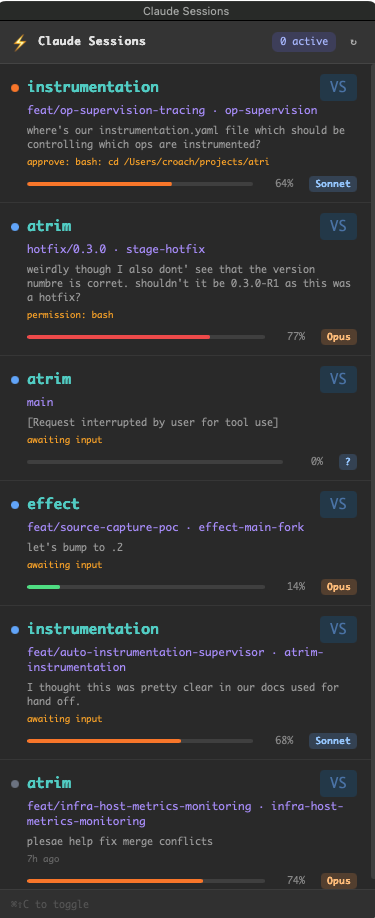

# Claude Session Tracker

A proof-of-concept Hammerspoon tool for monitoring Claude Code sessions running in tmux.



## What's in here

- **claude-tracker/** - Lua modules for Hammerspoon
  - `init.lua` - Main orchestration and session gathering
  - `config.lua` - Configuration (tmux patterns, paths)
  - `tmux.lua` - tmux integration and pane parsing
  - `claude.lua` - Claude JSONL parsing and session data extraction
  - `panel.lua` - WebView panel and JavaScript callbacks
  - `html.lua` - HTML/CSS templates for the UI
  - `utils.lua` - Utility functions

## Usage

1. Symlink or copy `claude-tracker/` to `~/.hammerspoon/claude-tracker/`
2. Add to your `~/.hammerspoon/init.lua`:
   ```lua
   require("claude-tracker")
   ```
3. Reload Hammerspoon config
4. Press `Cmd+Shift+C` to toggle the panel

## License

MIT
